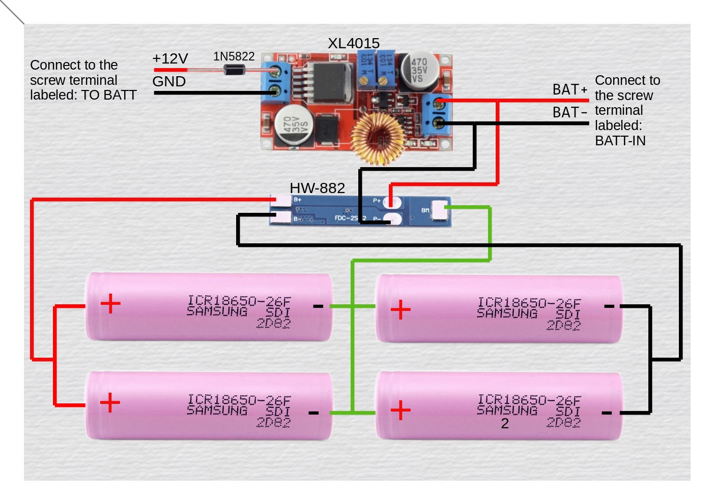

# DIY-UPS-for-WiFi-Router
A UPS for Wi-Fi routers and ONU with 4 hours of back-up.

# SPECIFICATIONS
Here is a breif table containing the main specs of the UPS:
| CATEGORY | VALUE |
| :---: | :---: | 
| Back-UP time | Upto 4 hours|
| No. of Output ports | 2 |
| Output Voltage | 12V(1A) & 9V(800mA) |
| Input Voltage | 12V |
| Battery Type | 2s-2p li-ion |
| Battery Voltage | 7.4V(nominal) |
| Battery Capacity | 4000mAH |

# POWER
Unlike many commercial devices, this DIY UPS utilises 2 * 12 volt adapter. One for powering the Router and ONU, and the other for charging the batteries.
The adapter connected to the female barrel port labelled ```12V-IN-MAIN``` powers both the router and ONU, while the one connected to the female barrel port labelled ```12-IN-2ND``` is used for the charging the battery.
However, using two adapters is not a must, the entire thing can be powered by a single 12 volt adapter. To do so follow these steps:
- Short the pads ```TP1``` & ```TP2``` on the bottomside of the PCB.
- Now, plug the 12V adapter to the female barrel port labelled ```12V-IN-2ND```.

### Note:
 When using a single 12V adpater to power as well as charge the batteries, do not plug the 12V adapter into the female barrel port labelled ```12V-IN-MAIN```. Use the port labelled ```12V-IN-2ND```. Also use an adapter rated at-least 1.5 amps(2A is preferrable).

# BATTERY PACK
The battery is a 2s 2p lithium-ion pack with a nominal voltage of 7.4 volts and a capacity of, 4000mAh approximately.
The batteries are managed by this HW-882 3 A BMS for 2s lithium-ion battery pack.
Soldering the components on the PCB is a straight forward as everything is labelled. This is why I decided to skip the soldering part and focus on the wiring of the battery pack and XL4015 to the PCB.

## WIRING OF THE BATTERY PACK

### Note:
Set the voltage and current on the XL4015 buck converter to 8.35 volts and 1.35 amps respectively before connecting it to the battery.

## WIRING BATTERY PACK TO THE PCB
Below are the steps to wire the battery pack and the XL4015 to the main PCB:
- The input from the battery connects to the srew terminal labelled ```BATT-IN```. 
- The input wires of the XL4015 plugs into the screw terminal labelled ```TO BATT```. 
### Note:
The positive side is marked by  ```+``` symbol beside screw terminal on the PCB.

# CHARGING SYSTEM
The batteries are charged by a XL4015 CC/CV 5A buck converter module, whose voltage and current must be set to 8.35 volts and 1.4 amps respectively.
The XL4015 module is powered by a 12V 2A adapter. If your 12V adapter is rated below 2A then lower the charging current on the buck converter to an appropriate level. Below are some reccommended charging current values in relation to the adapter's current rating:

| Adapter's Current Rating(A) | Charging Current(A) |
| :---: | :---: |
| 1 | 0.7 - 0.8 |
| 1.5 | 1 - 1.2 |
| 2 | 1.2 - 1.6 |

# PART LIST

| Part | Quantity |
| :---: | :---: |
| 0.1uF Cap | 2 |
| 220uF Cap | 1 |
| 470uF Cap | 1 |
| Female Barrel Jack | 4 |
| Male Barrel Jack | 4 |
| Screw Terminal_01x02 | 2 |
| XL6009 module | 1 |
| XL4015 CC/CV module | 1 |
| 7809 | 1 |
| Heat sink | 1 |
| SPST_Switch | 1 |
| HW-882 3 A BMS | 1 |
| 18650 2000mAH lion cell | 4 |
| 12V 2A adapter | 1 |
| 12V 1A adapter | 1 |

In additon to the items mentioned above, you will also need some other miscellaneous stuff like wires, etc.
